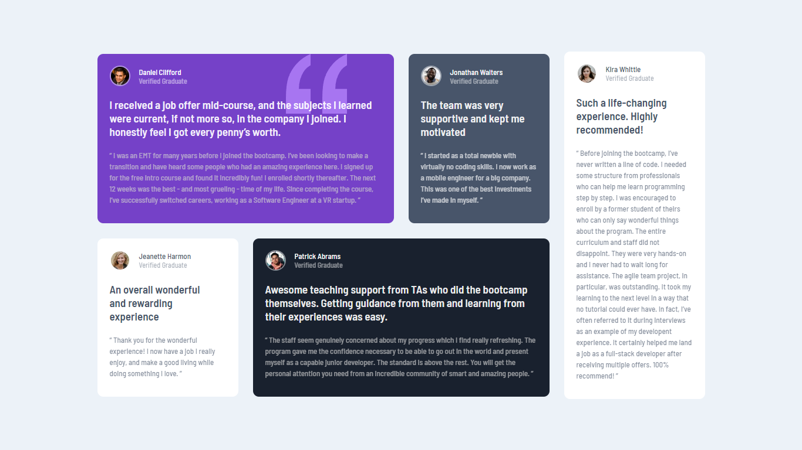

# Frontend Mentor - Testimonials grid section solution

### Screenshot

### Links

- Solution URL: [Add solution URL here]()
- Live Site URL: [Add live site URL here]()

## My process

### Built with
- Grid
- Semantic HTML5 markup
- CSS custom properties
- Flexbox
- Mobile-first workflow

### What I learned

I learned to use the grid better, since I had never put into practice what I learned about the grid in a project.
